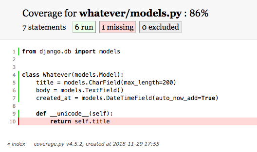
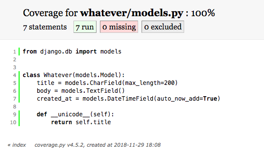
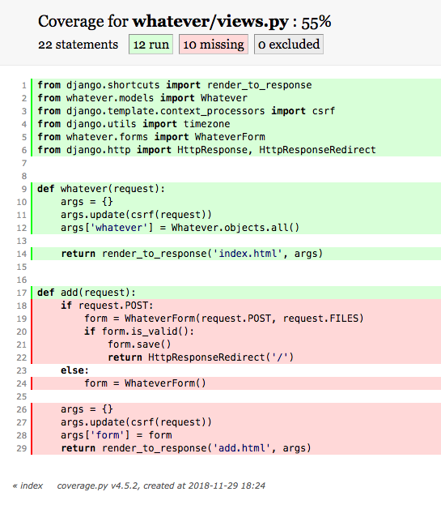

기본 예제에서는 다음을 테스트 한다.
* models
* views
* forms
* API

### Setup
`coverage`를 설치하고 `INSTALLED_APPS`에 추가 한다
```bash
pip install coverage==4.5.2
```

그리고 `coverage`를 실행 해보자
> 현재 원문의 `repo`에 있는 `django15` 앱은 실행이 `python3.6.5` 기준으로 실행 되지 않아서 본인의 `repo`에 있는 `app`을 사용 하면 된다.
> 그리고 `htmlcov`에 파일과 `whatever/tests.py`와 `whatevs/tests.py`에 있는 소스를 지우고 해야 한다.

```bash
coverage run manage.py test whatever -v 2
```
> 아직 테스트가 없기 때문에 그냥 진행 됨.

그리고 보고서를 만들어 보자
```bash
coverage html
```
> 그러면 `htmlcov`에 `html` 파일들이 생긴것을 확인 할 수 있다.

그리고 `htmlcov/index.html` 을 열어 `whatever/models.py.html`을 열면 아래와 같은 화면이 보인다
 


## 모델 테스트

기본적으로 이 보고서는 모델의 타이틀을 테스트 해야 하는것을 나타낸다.
`whatever/tests.py`를 열고 코드를 작성 해보자
```python
from django.test import TestCase
from whatever.models import Whatever
from django.utils import timezone


# models test
class WhateverTest(TestCase):
    def create_whatever(self, title="only a test", body="yes, this is only a test"):
        return Whatever.objects.create(title=title, body=body, created_at=timezone.now())

    def test_whatever_creation(self):
        w = self.create_whatever()
        self.assertTrue(isinstance(w, Whatever))
        self.assertEqual(w.__unicode__(), w.title)

```
`Whatever`객체를 만들고 생성된 객체의 제목이 예상 제목과 일치 하는지 테스트 했다.
> 함수 이름이 `test_`로 시작 하는지 확인 해야 한다. 일반적인 규칙이면서 `django-discover-runner`가 테스트를 찾을수 있도록 한다.
> 또한 모델에 추가하는 모는 메소드에 대한 테스트를 작성 해야 한다.

이제 다시 `coverage run`을 해보자

```bash
coverage run manage.py test whatever -v 2
```
그러면 통과된 테스트를 볼 수 있다.
```bash
test_whatever_creation (whatever.tests.WhateverTest) ... ok

----------------------------------------------------------------------
Ran 1 test in 0.001s

OK
```
그리고 다시 `coverage html`을 하고 보고서를 보면 모델이 100%로 되어 있어야 한다.



## 뷰 테스트
뷰 테스트는 때로는 어려울 수 있다. 일반적으로 상태 코드를 검사 하기 위해 단위 테스트를 사용한다. 
뿐만 아니라 `AJAX`, `Javascript`등을 테스트 하기 위해 `Selenium Webdriver`을 사용한다.

`whatever/tests.py`의 `WhateverTest`클래스에 다음 코드를 추가 한다.

```python
# views (uses reverse)
    def test_whatever_list_view(self):
        w = self.create_whatever()
        url = reverse('whatever.views.whatever')
        response = self.client.get(url)

        self.assertEqual(response.status_code, 200)
        self.assertIn(w.title, response.content.decode('utf-8'))
```


```bash
pip install selenium==3.141.0
```

여기서 우리는 클라이언트로 부터 `URL`을 가져와 다시 변수 `response`에 저장하고 응답코드가 200인지 테스트 한다음
실제 응답 컨텐츠를 테스트 한다. 그러면 다음의 결과를 얻어야 한다.

```bash
test_whatever_creation (whatever.tests.WhateverTest) ... ok
test_whatever_list_view (whatever.tests.WhateverTest) ... ok

----------------------------------------------------------------------
Ran 2 tests in 0.043s

OK
```

보고서(`coverage html`)을 다시 실행하면 `whatever/views`의 커버리지가 아래와 같이 나와야 한다.



또한 테스트를 작성하여 무엇이 실패 하는지 알수 있다. 예를들어 새 객체를 만들기 위해 사용자가 로그인 해야 하는경우
실제로 객체를 만들지 못하면 테스트는 성공한다.

셀레니움 테스트를 보자
```python
import os
import unittest
from selenium import webdriver


class TestSignup(unittest.TestCase):
    def setUp(self):
        current_folder = os.path.dirname(os.path.realpath(__file__))
        driver_path = os.path.join(current_folder, 'chromedriver')
        self.driver = webdriver.Chrome(driver_path)

    def test_signup_fire(self):
        self.driver.get("http://localhost:8000/add/")
        self.driver.find_element_by_id('id_title').send_keys("test title")
        self.driver.find_element_by_id('id_body').send_keys("test body")
        self.driver.find_element_by_id('submit').click()
        self.assertIn("http://localhost:8000/", self.driver.current_url)

    def tearDown(self):
        self.driver.quit()


if __name__ == '__main__':
    unittest.main()
```

> `runserver`를 하고 테스트를 해야 셀레니움이 잘 진행 된다.

테스트 진행후 오브젝트가 올바르게 생성 되었는지도 확인 해 보라.


## 폼 테스트

다음 메소드를 추가 함.
```python
    def test_valid_form(self):
        w = Whatever.objects.create(title='Foo', body='Bar')
        data = {'title': w.title, 'body': w.body}
        form = WhateverForm(data=data)
        self.assertTrue(form.is_valid())

    def test_invalid_form(self):
        w = Whatever.objects.create(title='Foo', body='')
        data = {'title': w.title, 'body': w.body}
        form = WhateverForm(data=data)
        self.assertFalse(form.is_valid())
```
`JSON`으로 폼의 데이터를 생성하는 방법에 유의 하여야 한다. 이것은 고정이다.

```bash
test_invalid_form (whatever.tests.WhateverTest) ... ok
test_valid_form (whatever.tests.WhateverTest) ... ok
test_whatever_creation (whatever.tests.WhateverTest) ... ok
test_whatever_list_view (whatever.tests.WhateverTest) ... ok
test_signup_fire (whatever.tests.TestSignup) ... ok

----------------------------------------------------------------------
Ran 5 tests in 4.405s

```
폼 자체의 유효성 검사기를 기반으로 특정 오류 메시지가 표시되는지 여부를 확인하는 테스트를 작성할 수도 있습니다.

## API 테스트

먼저 다음 URL에서 API에 액세스 할 수 있습니다. [http://localhost:8000/api/whatever/?format=json](http://localhost:8000/api/whatever/?format=json)
이것은 간단한 설정이므로 테스트도 상당히 간단합니다.

```bash
pip install lxml==4.2.5
pip install defusedxml==0.5.0
```
```python
from tastypie.test import ResourceTestCaseMixin


class EntryResourceTest(ResourceTestCaseMixin, TestCase):
    def test_get_api_json(self):
        resp = self.api_client.get('/api/whatever/', format='json')
        self.assertValidJSONResponse(resp)

    def test_get_api_xml(self):
        resp = self.api_client.get('/api/whatever/', format='xml')
        self.assertValidXMLResponse(resp)

```
각각의 경우 다른 응답을 받는다.
