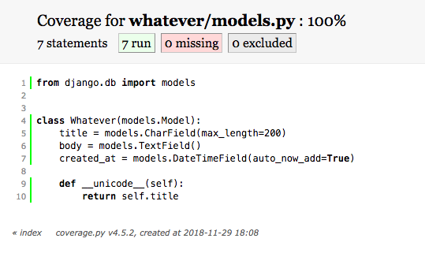

기본 예제에서는 다음을 테스트 한다.
* models
* views
* forms
* API

### Setup
`coverage`를 설치하고 `INSTALLED_APPS`에 추가 한다
```bash
pip install coverage
```

그리고 `coverage`를 실행 해보자
> 현재 원문의 `repo`에 있는 `django15` 앱은 실행이 `python3.6.5` 기준으로 실행 되지 않아서 본인의 `repo`에 있는 `app`을 사용 하면 된다.
> 그리고 `htmlcov`에 파일과 `whatever/tests.py`와 `whatevs/tests.py`에 있는 소스를 지우고 해야 한다.

```bash
coverage run manage.py test whatever -v 2
```
> 아직 테스트가 없기 때문에 그냥 진행 됨.

그리고 보고서를 만들어 보자
```bash
coverage html
```
> 그러면 `htmlcov`에 `html` 파일들이 생긴것을 확인 할 수 있다.

그리고 `htmlcov/index.html` 을 열어 `whatever/models.py.html`을 열면 아래와 같은 화면이 보인다
 

기본적으로 이 보고서는 모델의 타이틀을 테스트 해야 하는것을 나타낸다.
`whatever/tests.py`를 열고 코드를 작성 해보자
```python
from django.test import TestCase
from whatever.models import Whatever
from django.utils import timezone


# models test
class WhateverTest(TestCase):
    def create_whatever(self, title="only a test", body="yes, this is only a test"):
        return Whatever.objects.create(title=title, body=body, created_at=timezone.now())

    def test_whatever_creation(self):
        w = self.create_whatever()
        self.assertTrue(isinstance(w, Whatever))
        self.assertEqual(w.__unicode__(), w.title)

```
`Whatever`객체를 만들고 생성된 객체의 제목이 예상 제목과 일치 하는지 테스트 했다.
> 함수 이름이 `test_`로 시작 하는지 확인 해야 한다. 일반적인 규칙이면서 `django-discover-runner`가 테스트를 찾을수 있도록 한다.
> 또한 모델에 추가하는 모는 메소드에 대한 테스트를 작성 해야 한다.

이제 다시 `coverage run`을 해보자

```bash
coverage run manage.py test whatever -v 2
```
그러면 통과된 테스트를 볼 수 있다.
```bash
test_whatever_creation (whatever.tests.WhateverTest) ... ok

----------------------------------------------------------------------
Ran 1 test in 0.001s

OK
```
그리고 다시 `coverage html`을 하고 보고서를 보면 모델이 100%로 되어 있어야 한다.
