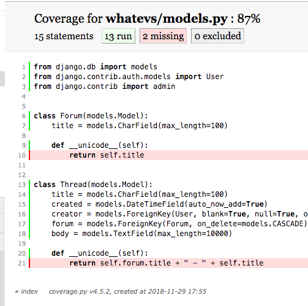
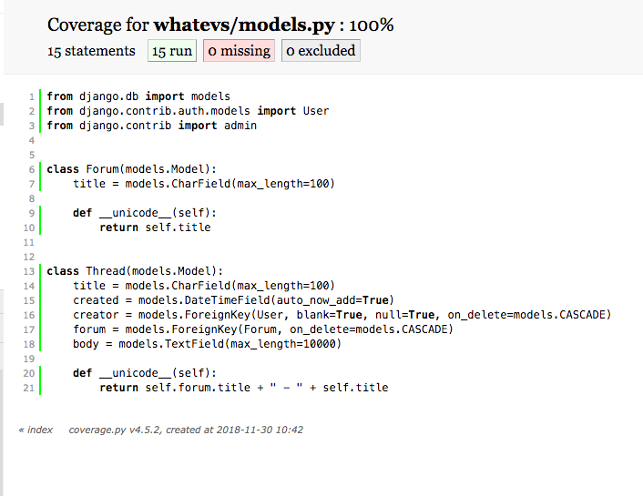

이번에는 좀더 복잡한 예제를 보여 주고 샘플 데이터를 만들기 위해 `Model Mommy`를 소개 한다.

## 왜 조심해야 하는가?
`Fixtures`와 `ORM`을 이용해서 데이터를 채우면 모델이 변경 될 때마다 업데이트 해야 한다.

요약하면 `Django Testing Fixtures`는 다음과 같은 이유로 문제가 된다.

* 모델/스키마를 변경 할 때마다 업데이트 해야 한다.
* 매우 느리다
* 때로는 하드코딩된 데이터로 인행 테스트가 실패 할수도 있다.

그래서 `Model Mommy`를 이용하여 더 빠른 로드와 유지관리가 훨씬 쉬운 `Fixtures`를 만들 수 있다.


## Django Testing Fixtures
이전 글에서 본 테스트 모델을 보면
```python
class WhateverTest(TestCase):
    def create_whatever(self, title="only a test", body="yes, this is only a test"):
        return Whatever.objects.create(title=title, body=body, created_at=timezone.now())

    def test_whatever_creation(self):
        w = self.create_whatever()
        self.assertTrue(isinstance(w, Whatever))
        self.assertEqual(w.__unicode__(), w.title)

```
여기서 우리는 단순히 `Whatever()`객체를 만들고 생성 된 제목이 예상과 일치 한다고 생각함.

`coverage`테스트를 실행하면 1개의 테스트가 통과되는것을 확인 했다.

이제는 각 필드에 값을 넣으며 새로운 인스턴스를 생성하는 대신에 `Model Mommy`를 사용하여 객체 생성 프로세스를 간소화 시킬 수 있다.


## Model Mommy

설치
```bash
pip install model_mommy
```

`Whatever`모델
```python
class Whatever(models.Model):
    title = models.CharField(max_length=200)
    body = models.TextField()
    created_at = models.DateTimeField(auto_now_add=True)

    def __unicode__(self):
        return self.title

```
이제는 `model_mommy`를 이용해 더 쉬운 방법으로 테스트를 진행 할 수 있다.
```python
class WhateverTest(TestCase):
    def create_whatever(self):        
        what = mommy.make(Whatever)
        return what
```


## New Model
좀더 복잡한 예제를 살펴 보면

현재 `whatevs`모델은 이렇게 생겨 있다.
```python
from django.db import models
from django.contrib.auth.models import User
from django.contrib import admin


class Forum(models.Model):
    title = models.CharField(max_length=100)

    def __unicode__(self):
        return self.title


class Thread(models.Model):
    title = models.CharField(max_length=100)
    created = models.DateTimeField(auto_now_add=True)
    creator = models.ForeignKey(User, blank=True, null=True, on_delete=models.CASCADE)
    forum = models.ForeignKey(Forum, on_delete=models.CASCADE)
    body = models.TextField(max_length=10000)

    def __unicode__(self):
        return self.forum.title + " - " + self.title

```
커버리지 보고서는 이렇게 생겼다




## Test

```python
from django.test import TestCase
from model_mommy import mommy

from whatevs.models import Forum, Thread


class WhateverTestMommy(TestCase):
    def test_forum_creation_mommy(self):
        new_forum = mommy.make('whatevs.Forum')
        new_thread = mommy.make('whatevs.Thread')
        self.assertTrue(isinstance(new_forum, Forum))
        self.assertTrue(isinstance(new_thread, Thread))
        self.assertEqual(new_forum.__unicode__(), new_forum.title)
        self.assertEqual(
            new_thread.__unicode__(),
            (str(new_thread.forum.title) + " - " + str(new_thread.title))
        )

```
테스트를 진행하면
```bash
coverage run manage.py test whatevs -v 2
coverage html

```

이렇게 커버리지가 바뀐다.

